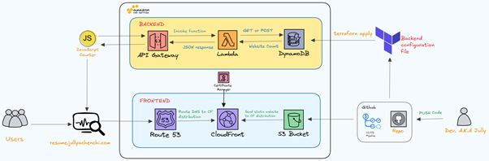
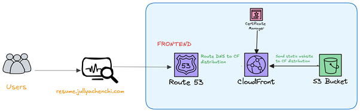
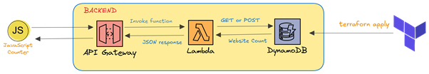
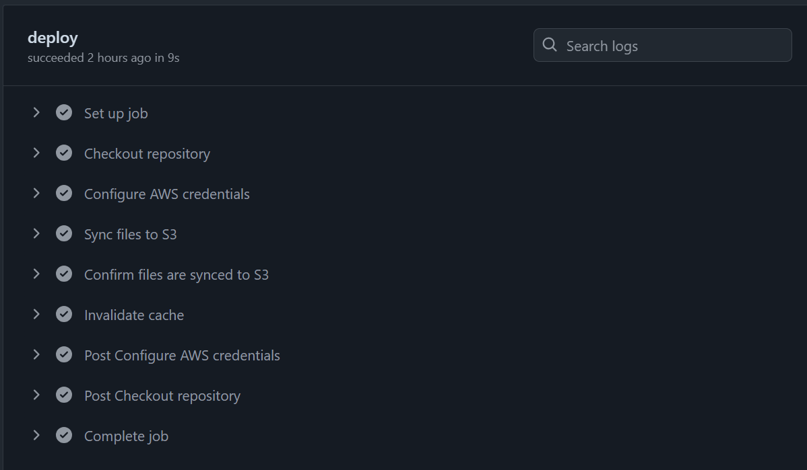

# Cloud Resume Challenge
## Introduction
**Project Overview** - This is my implementation of the [cloud resume challenge](https://cloudresumechallenge.dev/) as coined by [Forrest Brazeal](https://www.linkedin.com/in/forrestbrazeal/), where I create a resume website using HTML, CSS, and JavaScript and host it on AWS 

**Final outcome** - A working website with a custom domain name. It also shows the number of times the website has been viewed.

You can view my website [here](https://jullyachenchi.com/)


**Technologies used**
- HTML, CSS, JavaScript
- Terraform
- AWS S3
- AWS Dynamodb
- AWS API Gateway
- AWS CloudFront
- AWS Route 53
- AWS Lambda
- GitHub Actions
- Python
- AWS Certificate Manager

## Architecture


## Frontend 
Frontend development involved building my website in HTML, CSS, and JavaScript, hosting my website on S3, serving the website contents through CloudFront and accessing the website using a custom domain name from Route 53.

### HTML and CSS

### JavaScript
The website includes a simple JavaScript script for counting the number of page visits.
### Why CloudFront?
- CloudFront is a global service that allows users from across the globe to access my website from a nearby edge location at low latency.
- Using CloudFront ensures that I keep my bucket contents private.

### Route 53
Route 53 was used to register a domain name. A domain can also be referred to as a hosted zone. I created an A record within the hosted zone that points to the CloudFront distribution. A record is also referred to as a subdomain

## Backend - Infrastructure as code
The backend chunk of the challenge involved configuring an API Gateway that triggers a Lambda function to update and retrieve the number of page visits in a dynamodb table. The backend infrastructure was provisioned using Terraform.



### Database - Dynamodb
The number of page visits is saved and retrieved from a sinle table in AWS Dynamodb

### API Gateway
The JavaScript code is not communicating to dynamodb directly but rather, using Amazon API Gateway. The API is set with 2 routes: **POST** request for proxying the Lambda function and a **GET** request to receive the number in the dynamodb table.
```hcl
resource "aws_apigatewayv2_api" <name>{
    name = <your-api-name>
    protocol_type = "HTTP"
    description = <description>

    cors_configuration {
      allow_credentials = false
      allow_headers = []
      allow_origins = [
        "*"
      ]
      allow_methods = [
        "GET",
        "POST"]
      max_age = 3600
    } 
}
```
### Python
The Lambda function responsible for updating and retrieving the page visits number is written in `python 3.9`
The python code uses `boto3` library 

```python
import json
import boto3
```
To provision your infrastructure using terraform, run:
- `terraform init` which initializes terraform
- `terraform plan` which verifies that your configuration is okay as well as gives you a summary of the resources to be provisioned.
- `terraform apply` which provisions your resources 

## Frontend and Backend Integration
This section involves embedding the value retrieved from Dynamodb into the JavaScript code, making the page dynamically count and display the total number of page visits 

The script responsible for this is found in the `main.js` file.

## CI/CD
To streamline the configuration changes and any future updates to the website, the deployment is automated using a dedicated pipeline workflow written in `yaml` that is executed in `github actions`

The pipeline workflow specifies the steps to be followed which includes:
- Configuring AWS Credentials for secure access.
- Synching files to S3
- Invalidating cache which ensures that any changes are reflected in the least amount possible. Near-real time.

The pipeline workflow can be seen in `.github/workflows/frontend.yml`


# Project costs
The project is designed to be executed within the free tier provision. However, the additional cost incurred was:
|**Cost**|**Purpose**|
|---------|----------|
$ 15| Custom domain name|

# Contributing
Contributions are welcome. If you find any issue or have improvements to suggest, feel free to open a GitHub issue or submit a pull request.
